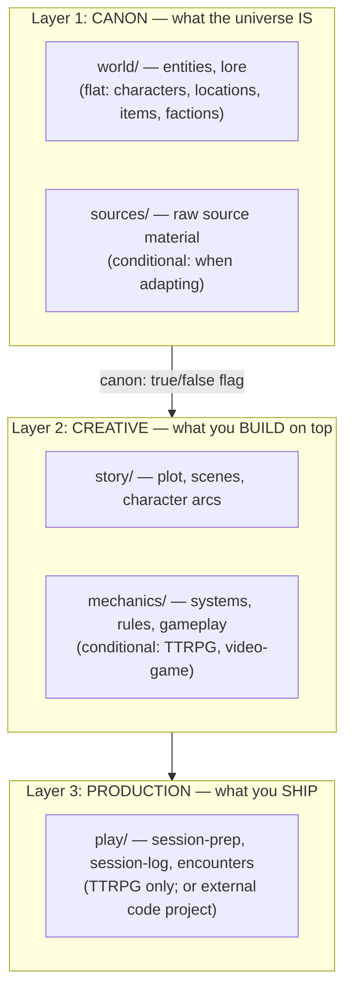
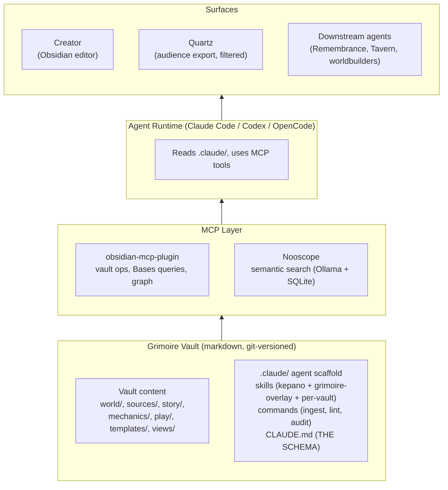

# Brainstorm Overview

> High-level vision, three-layer model, vault structure, canon system, downstream consumers. Topic-specific deep dives in sibling files.

## Core Identity

- **name**: Grimoire
- **emoji**: 📜
- **what**: a reusable Obsidian vault template for any creative worldbuilding project
- **for whom**: a single creator working alone or in dialogue with an AI agent
- **delivery**: Copier template, git-versioned
- **naming convention**: lowercase kebab-case for all folders and files
- **language convention**: vault structure / file names / English-language tooling stay in English. Project content (notes, characters, lore, mechanics, story) can be in any language. (Niklas's Hologrammatica campaign will be in German with HTBAH.)

## v1 Validation Targets

Grimoire's design is grounded in two concrete projects Niklas is actively planning:

1. **Hologrammatica** — a TTRPG (Pen & Paper) campaign adapted from Tom Hillenbrand's novel "Hologrammatica," using the HTBAH ruleset. Primary validation case for the TTRPG project type.
2. **Prisma** — a fan-made top-down ARPG built in Godot, drawing from Brent Weeks's Lightbringer series. Primary validation case for the video-game project type.

Other media types (novels, screenplays, board games) are envisioned as future use cases. The data model is designed to accommodate them; v1 just doesn't ship custom support for them.

## The Three-Layer Model

Every Grimoire vault is organized around three conceptual layers. This is the core framework.



### How the layers split conceptually

- **Layer 1 is what *is*.** The world as a structured graph: who exists, where things are, what factions hold power, what magic systems work how, what events happened in the source. Both adapted from sources and originally invented content can be canon — the `canon: true` property says "this is established as true for the universe."
- **Layer 2 is what *we make*.** The plot we're crafting, the systems we're designing, the arcs we're tracing. Built on top of Layer 1's canon.
- **Layer 3 is what *we ship*.** The played sessions, the written chapters, the running game code, the staged screenplay. For TTRPG it lives inside the vault (`play/`). For a video game it lives in a separate code project. For a novel it could live as `chapters/` in the vault.

### Why this model

- **Universal across media.** Layers 1 and 2 are medium-agnostic. Layer 3 is medium-specific in folder name and content, but the conceptual role is identical.
- **Downstream-consumer-friendly.** Multiple AI services can read different layers for different purposes (see [integrations.md](integrations.md)).
- **Adaptation-respecting.** When adapting from existing media, `sources/` preserves the original's story separately from our adaptation; `canon: true` keeps the canonical record clean.

> [!tip]
> **The three-layer model is a domain-specific implementation of Karpathy's LLM-wiki pattern.** Karpathy describes the same architecture for personal knowledge management — raw sources, LLM-distilled wiki pages, schema (CLAUDE.md / AGENTS.md) governing both. Grimoire applies it to creative worldbuilding with domain-appropriate names: `sources/` is raw, `world/` is the wiki (canonical entity pages), and CLAUDE.md plus Copier-generated templates are the schema. The same three operations apply: **ingest** new sources into world entries, **query** the canon to answer questions, **lint** for canon consistency and orphans. Recognising the alignment matters because it means tooling built for one (e.g. ingest workflows, vault gardeners) ports cleanly to the other.

## Stack at a Glance

A generated Grimoire vault sits inside a layered architecture. The template ships the bottom two layers; the user provides the runtime and surfaces. Validated separately by the Mikoshi rebuild and applied here to creative work.



**Layer ownership:**

| Layer | Ships with template? | Notes |
|---|---|---|
| Vault content | Empty scaffolding ships; creator fills in | Per `project_type` and `include_sources` |
| `.claude/skills/` (kepano + grimoire-overlay) | Yes, via Copier | `copier update` propagates upstream changes |
| `.claude/skills/<project>-canon/` | Empty skeleton ships; creator fills in | Copier never overwrites |
| `.claude/commands/` | Yes, via Copier | Universal + project_type-conditional |
| `CLAUDE.md` schema | Yes, via Copier | Karpathy governance doc; loaded first by agent |
| MCP plugin + embedding service | No — user runs externally | Typically on Qube for Niklas |
| Agent CLI | No — user installs | Claude Code, Codex, OpenCode all read `.claude/` |
| Quartz audience export | No — user runs externally (Qube) | Filters `canon: true` + `status: revealed` |

Full breakdown of each layer in [infrastructure.md](infrastructure.md#agent-runtime-layer); audience-export specifics in [integrations.md](integrations.md#audience-facing-export-workflow-future).

## Vault Structure

```
{{project_name}}/
├── world/              ← Layer 1a: entities + lore (flat, no subfolders)
├── sources/            ← Layer 1b: source material (conditional: adapted/existing-universe)
├── story/              ← Layer 2a: narrative work (always)
├── mechanics/          ← Layer 2b: systems work (conditional: TTRPG, video-game)
├── play/               ← Layer 3: TTRPG production (conditional: project_type == ttrpg)
├── sources/            ← optional, raw source material
├── assets/             ← images, audio, soundboards
├── templates/          ← flat note templates
├── views/              ← Bases .base view files
├── home.md             ← project dashboard with Bases views
├── world-primer.md     ← Layer 1 primer (the universe overview)
├── style-guide.md      ← visual + tonal identity (Earliest Usable, auto-populated)
└── README.md           ← "Conjured with Grimoire" attribution
```

**Why `world/` stays flat:** entities form a graph, not a tree. A 200-character vault navigates via Bases queries (filter by faction, location, status), not by browsing subfolders.

**Why `templates/` is flat:** small fixed set; naming carries the role (`encounter-combat.md`, not `encounters/combat.md`).

**Why encounters live in `play/`, not `story/`:** encounters are session-specific Layer-3 artifacts ("the combat for session 7"), linked to a session by the `session:` property. They're not part of the broader narrative plan.

## The Canon Property

`canon: true | false` on every entity. Distinguishes canonical-to-the-universe content from user-invented additions.

| Case | `canon` value | When |
|---|---|---|
| Character extracted from a source novel | `true` | Adapting an existing work |
| Location invented by you for an original universe | `true` | You're the canon authority; everything you establish IS canon |
| One-off NPC for a TTRPG session that doesn't fit the source's canon | `false` | Filling a believable gap for play purposes, but not part of the universe's true canon |
| A self-invented faction added to a Hologrammatica TTRPG that wouldn't exist in Hillenbrand's novel | `false` | Marked so downstream consumers (Remembrance generating "canon stories") can skip it |

**Default:** `canon: true`. Users explicitly mark `false`.

The `source` property (already in templates) stays alongside for attribution: `source: "Hillenbrand 2018"`, `source: "Lightbringer Wiki"`, `source: "self"`. `canon` is the boolean filter; `source` is the citation.

## Downstream Consumers

The Grimoire vault is the universal data substrate for the rest of the creative ecosystem.

- **You / a creator** — build Layer 2 on top of Layer 1; run Layer 3 if TTRPG
- **AI worldbuilding partner** (e.g. Claude / Momo via Corset) — read Layer 1 as canon, help generate Layer 2 content, brainstorm additions
- **Remembrance** — read Layer 1 (`world/` + `sources/`) filtered by `canon: true` to generate canonical lore audio in the universe; OR read Layer 2 + Clairvoyance artifacts to generate "stories from our adaptation"
- **Clairvoyance** — record live TTRPG sessions; artifacts feed back to Remembrance
- **Tavern (far future)** — AI Dungeon Master that reads the entire vault and runs TTRPG sessions autonomously
- **Other future AI agents** — novel writers, screenplay drafters, mechanics designers consuming Layer 1+2

See [integrations.md](./integrations.md) for the full creative loop diagram.

## Topic Deep Dives

| File | Content |
|---|---|
| [templates.md](./templates.md) | All flat note templates per layer, properties system (incl. canon flag), visual conventions |
| [features.md](./features.md) | Features mapped by layer: audio, GenAI provenance, end-of-project workflow, spoiler management |
| [integrations.md](./integrations.md) | The creative loop, downstream consumers, Hologrammatica + Prisma as v1 validation |
| [infrastructure.md](./infrastructure.md) | Plugin strategy per project_type, genre theming, QA/CI, git management, Copier setup |
| [ruleset.md](./ruleset.md) | TTRPG-specific addendum: HTBAH mechanics, character system |
